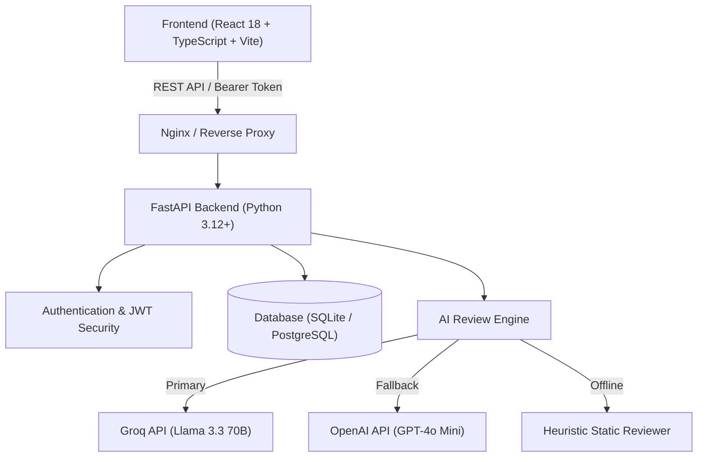

# CodePilot AI

<div align="center">


**An intelligent, automated code review and security auditing platform designed for modern engineering teams.**

[](https://fastapi.tiangolo.com)
[](https://reactjs.org)
[](https://www.typescriptlang.org)
[](https://vitejs.dev)
[](https://www.docker.com)
[](LICENSE)

</div>

---

## Overview

**CodePilot AI** is a full-stack automated code intelligence application that inspects source code snippets for security vulnerabilities, syntax defects, logic bugs, and performance anti-patterns. Powered by Large Language Models (Groq / OpenAI) with heuristic fallback engines, it delivers instant, structured engineering feedback with actionable recommendations, line-by-line defect pointers, and overall code quality scores.

---

## Key Features

- **Security Vulnerability Auditing**: Identifies arbitrary code execution (`eval`/`exec`), SQL injection, hardcoded secrets, and common CWE/OWASP risks.
- **Bug and Defect Detection**: Detects unhandled exceptions, zero divisions, logic bugs, and boundary condition failures.
- **Performance and Optimization Insights**: Pinpoints memory leaks, redundant computations, and algorithmic inefficiencies.
- **Quantitative Quality Scores**: Delivers 0–100 code health ratings, risk classifications (`Low`, `Medium`, `High`, `Critical`), and actionable refactoring tips.
- **Broad Language Support**: First-class support for **Python, JavaScript, TypeScript, Go, Java, C/C++, Rust, SQL, HTML/CSS**, and **Shell/Bash**.
- **Secure JWT Authentication**: User registration and login with bcrypt-hashed credentials, token-based session persistence, and isolated review history.
- **Personal Review Analytics**: Track total audits, completion rates, language distributions, and historical trends.
- **Containerized Deployment**: Production-ready `Dockerfile` configurations and `docker-compose` orchestration with Nginx reverse proxying.

---

## Architecture and Tech Stack



### Stack Breakdown

| Layer | Technologies |
| :--- | :--- |
| **Frontend** | React 18, TypeScript, Vite, React Router v6, Axios, Modern Vanilla CSS (Glassmorphism design system) |
| **Backend** | FastAPI, SQLAlchemy 2.0 ORM, Pydantic v2, Python-JOSE (JWT), Passlib (Bcrypt), Uvicorn |
| **AI Services** | Groq SDK (`llama-3.3-70b-versatile`), OpenAI SDK (`gpt-4o-mini`), Static Heuristic Rule Engine |
| **Database** | SQLite (Default Dev), PostgreSQL ready via SQLAlchemy |
| **DevOps** | Docker, Multi-stage Dockerfiles, Nginx Alpine, Docker Compose |

---

## Project Structure

```text
CodePilot-AI/
├── backend/
│   ├── app/
│   │   ├── api/
│   │   │   ├── dependencies.py          # OAuth2 bearer token authentication
│   │   │   └── v1/
│   │   │       └── endpoints/
│   │   │           ├── auth.py          # User registration, login, and profile
│   │   │           └── reviews.py       # Code review submission, pagination, stats
│   │   ├── core/
│   │   │   ├── config.py                # Environment configuration & Pydantic settings
│   │   │   └── security.py              # Password hashing & JWT encoding/decoding
│   │   ├── crud/
│   │   │   ├── review.py                # Database operations for code reviews
│   │   │   └── user.py                  # Database operations for users
│   │   ├── db/
│   │   │   ├── database.py              # SQLAlchemy engine & session maker
│   │   │   └── dependencies.py          # Database session generator
│   │   ├── models/
│   │   │   ├── code_review.py           # CodeReview ORM model
│   │   │   └── user.py                  # User ORM model
│   │   ├── schemas/
│   │   │   ├── review.py                # Review request/response Pydantic models
│   │   │   └── user.py                  # User registration/login Pydantic models
│   │   ├── services/
│   │   │   └── ai_reviewer.py           # Multi-provider LLM review engine
│   │   └── main.py                      # FastAPI entrypoint & CORS middleware
│   ├── tests/
│   │   ├── conftest.py                  # Pytest fixtures & in-memory test database
│   │   ├── test_auth.py                 # Registration & login tests
│   │   └── test_reviews.py              # Review lifecycle, ownership & pagination tests
│   ├── Dockerfile                       # Backend container definition
│   └── requirements.txt                 # Python dependencies
├── frontend/
│   ├── src/
│   │   ├── api/
│   │   │   └── apiClient.ts             # Axios instance with 401 interceptor
│   │   ├── components/
│   │   │   ├── Navbar.tsx               # Global navigation header
│   │   │   └── ProtectedRoute.tsx       # Route authentication guard
│   │   ├── pages/
│   │   │   ├── DashboardPage.tsx        # Developer workspace & quick metrics
│   │   │   ├── HomePage.tsx             # Landing page & feature showcase
│   │   │   ├── LoginPage.tsx            # Sign in interface
│   │   │   ├── RegisterPage.tsx         # Account registration
│   │   │   ├── ReviewDetailPage.tsx     # Structured review report & findings
│   │   │   ├── ReviewFormPage.tsx       # Code submission editor & metrics
│   │   │   ├── ReviewsPage.tsx          # Review audit history & filters
│   │   │   └── StatsPage.tsx            # Analytics & language breakdown
│   │   ├── utils/
│   │   │   └── auth.ts                  # Token management helpers
│   │   ├── App.tsx                      # App router & layout shell
│   │   ├── index.css                    # Design tokens & glassmorphic styles
│   │   ├── main.tsx                     # React root mount
│   │   └── vite-env.d.ts                # Vite environment typings
│   ├── Dockerfile                       # Multi-stage frontend container (Node + Nginx)
│   └── package.json                     # Frontend dependencies & scripts
├── docker-compose.yml                   # Multi-service container orchestration
└── README.md                            # Project documentation
```

---

## Getting Started

### Prerequisites

- [Node.js](https://nodejs.org/) (v18+) and `npm`
- [Python](https://www.python.org/) (v3.12+)
- *(Optional)* [Docker](https://www.docker.com/) and [Docker Compose](https://docs.docker.com/compose/)

---

### Option 1: Running with Docker Compose (Quickest)

1. **Clone the repository:**
   ```bash
   git clone https://github.com/Simphiwe365/CodePilot-AI.git
   cd CodePilot-AI
   ```

2. **Configure environment variables (Optional):**
   Create a `.env` file in the project root:
   ```env
   SECRET_KEY=your-super-secret-key-change-this
   GROQ_API_KEY=gsk_your_groq_api_key_here
   OPENAI_API_KEY=sk_your_openai_api_key_here
   ```

3. **Start the containers:**
   ```bash
   docker compose up --build
   ```

4. **Access the application:**
   - **Frontend UI**: [http://localhost:3000](http://localhost:3000)
   - **Backend API**: [http://localhost:8000](http://localhost:8000)
   - **Interactive API Docs (Swagger)**: [http://localhost:8000/docs](http://localhost:8000/docs)

---

### Option 2: Running Locally (Development Mode)

#### 1. Start Backend

```bash
cd backend

# Create and activate virtual environment
python -m venv venv
# On Windows:
.\venv\Scripts\activate
# On Linux/macOS:
source venv/bin/activate

# Install dependencies
pip install -r requirements.txt

# Run development server
uvicorn app.main:app --reload --host 127.0.0.1 --port 8000
```

#### 2. Start Frontend

```bash
cd frontend

# Install Node dependencies
npm install

# Start Vite development server
npm run dev
```

The frontend will run at `http://localhost:5173` (or `http://localhost:4173`) and automatically proxy API requests to the FastAPI backend at `http://localhost:8000`.

---

## Environment Variables

Create a `.env` file in the `backend/` directory or project root:

| Variable | Type | Default | Description |
| :--- | :---: | :--- | :--- |
| `DATABASE_URL` | `string` | `sqlite:///./test.db` | Database connection string (SQLite or PostgreSQL) |
| `SECRET_KEY` | `string` | `dev-secret-key-...` | Secret key for signing JWT tokens |
| `ACCESS_TOKEN_EXPIRE_MINUTES` | `integer` | `1440` (24h) | JWT access token expiration duration |
| `GROQ_API_KEY` | `string` | `None` | Groq API Key for primary high-speed LLM reviews |
| `GROQ_MODEL` | `string` | `llama-3.3-70b-versatile` | Groq model identifier |
| `OPENAI_API_KEY` | `string` | `None` | OpenAI API Key for fallback reviews |
| `MAX_CODE_LENGTH` | `integer` | `50000` | Max character limit for code submissions |
| `DEBUG` | `boolean` | `False` | Enable SQLAlchemy verbose SQL echo logging |

> **Note**: If neither `GROQ_API_KEY` nor `OPENAI_API_KEY` is provided, CodePilot AI automatically falls back to its built-in **Heuristic Rule Engine**, allowing full offline usage and testing.

---

## REST API Reference

### Authentication Endpoints
| Method | Endpoint | Description | Auth Required |
| :--- | :--- | :--- | :---: |
| `POST` | `/auth/register` | Register a new user account | No |
| `POST` | `/auth/login` | Authenticate user & retrieve JWT access token | No |
| `GET` | `/auth/me` | Retrieve profile info of the logged-in user | Yes |

### Code Review Endpoints
| Method | Endpoint | Description | Auth Required |
| :--- | :--- | :--- | :---: |
| `POST` | `/reviews/` | Submit code snippet for automated AI review | Yes |
| `GET` | `/reviews/` | List user's code reviews (with `skip` & `limit` pagination) | Yes |
| `GET` | `/reviews/{id}` | Get detailed review report by ID | Yes |
| `DELETE` | `/reviews/{id}` | Delete a review record owned by user | Yes |
| `GET` | `/reviews/stats` | Retrieve user review metrics & language stats | Yes |

---

## Testing

### Backend Unit and Integration Tests

```bash
cd backend
python -m pytest
```

### Frontend Typecheck and Production Build

```bash
cd frontend
npm run build
```

---

## License

Distributed under the **MIT License**. See [LICENSE](LICENSE) for more information.

---

<div align="center">
  <sub>Engineered with precision by <strong>Simphiwe Mbatha</strong>.</sub>
</div>
